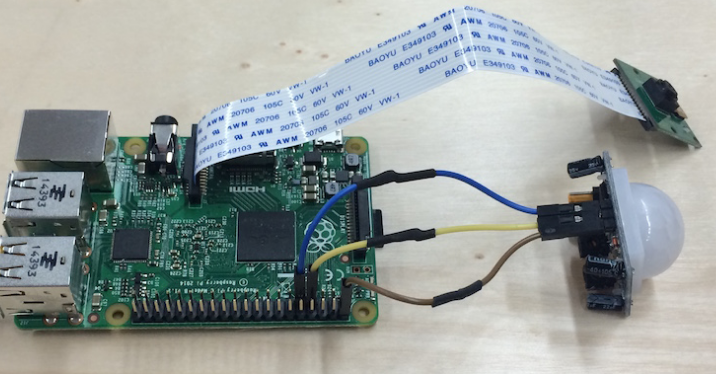
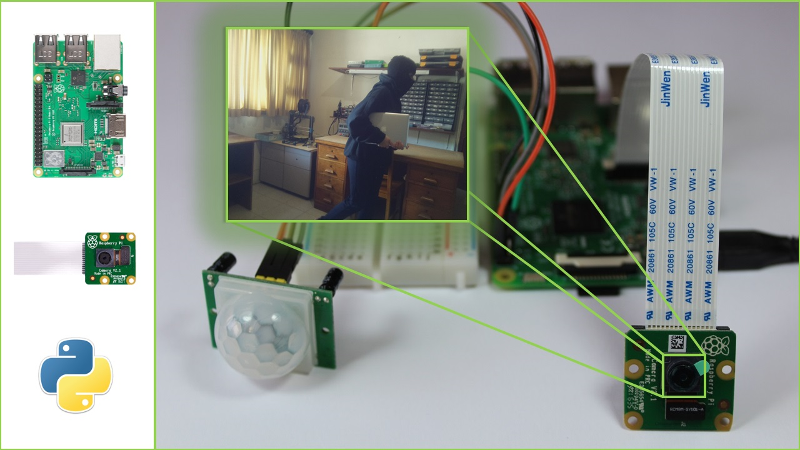

# 🔒 Spy Cam Security System (Raspberry Pi + PIR + Camera + Email Alerts)

A simple **IoT-based security surveillance system** built with a **Raspberry Pi 4B**, **PIR motion sensor (RE200B)**, and a **Pi Camera**.
The system detects motion, captures an image, and sends it via email as a security alert.

---

## 📷 How It Works

1. **Motion Detection** → The **RE200B PIR sensor** detects movement.
2. **Image Capture** → The **Pi Camera** takes a snapshot.
3. **Email Alert** → The system emails the image using Python’s `smtplib` and `email` libraries.

---

## 🧾 Requirements

Install the required Python libraries:

```bash
pip install -r requirements.txt
```

**requirements.txt**

```txt
gpiozero
picamera
# smtplib and email are built-in with Python
```

---

## 🔌 Circuit Diagram

### 🧠 Sensor Wiring to Raspberry Pi GPIO Pins

| Component | Raspberry Pi Pin |
| --------- | ---------------- |
| PIR VCC   | 5V (Pin 2)       |
| PIR GND   | GND (Pin 6)      |
| PIR OUT   | GPIO 17 (Pin 11) |
| Pi Camera | CSI Port         |

📌 _Refer to the circuit diagram and physical setup images for better clarity._

**Circuit Diagram:**


---

## 🖼️ Physical Setup

- Place the **PIR sensor** in a location facing the area to monitor.
- Connect the **Pi Camera** to the CSI port of Raspberry Pi.
- Ensure the Raspberry Pi has internet access for sending emails.

**Physical Setup:**


---

## 🐍 Python Script

Main script: **`security_cam.py`**
Handles:

- PIR sensor input
- Camera capture
- Email sending with attachments

---

## 📩 Output Sample

When motion is detected:

- ✅ Image is captured
- ✅ Email alert is sent with the photo attached

**Sample Output:**


---

## ✅ Key Features

- 📡 Real-time motion detection using PIR sensor
- 📷 Automatic image capture with Pi Camera
- 📧 Instant email alerts via SMTP
- ⚡ Fully standalone operation

---

## 📦 File Structure

```
spy-cam-security-system
├── 📖 README.md
├── 🖼️ circuit_diagram.png
├── 🖼️ cirsuit_setup.png
├── 📄 requirements.txt
├── 🐍 security_cam.py
└── 🖼️ system_working_sample.webp
```

---

## 🧠 What I Learned

- GPIO programming with **gpiozero**
- Camera handling with **picamera**
- Sending emails with attachments in Python
- Building a fully integrated **hardware + software IoT project**

---

## 🛠️ Future Improvements

- 🎥 Add video recording support
- 📲 Send alerts via Telegram/WhatsApp
- ☁️ Upload captured images to cloud storage

---

## 🚀 Getting Started

1. Clone the repository:

   ```bash
   git clone https://github.com/your-username/spy-cam-security-system.git
   cd spy-cam-security-system
   ```

2. Install dependencies:

   ```bash
   pip install -r requirements.txt
   ```

3. Run the program:

   ```bash
   python3 security_cam.py
   ```

4. Trigger the PIR sensor → receive email alert with snapshot!

---

## 🛡️ License

This project is licensed under the **MIT License** – feel free to modify and use it for personal or educational purposes.

---
